----------


# VUE基础知识学习

1. v-show和v-if的区别与应用场景
   v-show有较强的渲染开销
   v-if有较强的切换开销

2. 怎么理解事件监听器和子组件？
3. 列表渲染：
   
   较为复杂的数据
   
  4. 通过key来管理v-for的循环
     
## VUE的事件处理
1. 
2. DOM的解释
~~~
"DOM" 是 "Document Object Model"（文档对象模型）的缩写。DOM 是一种用于表示和操作文档的标准化方式，通常指的是 HTML 和 XML 文档。DOM 将文档内容（如元素、属性、文本）以一个树状结构的方式表示，每个节点都代表文档中的一个元素、属性或文本节点。

在网页开发中，DOM 在浏览器中充当一个接口，允许开发人员通过编程方式操作和修改网页的内容、结构和样式。使用 DOM，开发人员可以通过 JavaScript 等脚本语言来动态地改变网页内容，例如添加、删除、修改元素，改变样式，以及对用户操作做出响应。

DOM 的树状结构允许开发人员通过遍历节点、访问属性和执行操作来与文档进行交互。这种交互性使得动态网页和 Web 应用程序的开发变得更加灵活和交互性。

总之，DOM 是一种用于表示和操作文档的标准化模型，它在网页开发中扮演了重要的角色，允许开发人员通过脚本语言与网页进行动态交互和修改。
~~~
3. DOM事件的解释
~~~
DOM 事件是指在网页中发生的各种交互和操作，例如用户点击、输入文本、移动鼠标等，都可以触发不同类型的 DOM 事件。这些事件允许开发人员通过 JavaScript 等脚本语言来捕获和处理用户的操作，以实现动态交互和响应。

每个 DOM 元素都可以监听多种不同类型的事件，如点击事件、键盘事件、鼠标移动事件等。当事件被触发时，网页中的相应元素会发送一个信号，通知网页的脚本代码来处理这个事件。开发人员可以通过添加事件监听器（也称为事件处理函数）来定义在特定事件发生时要执行的操作。

以下是一些常见的 DOM 事件类型：

- **点击事件（click）**：当用户点击一个元素时触发，通常用于响应用户的鼠标点击操作。

- **键盘事件（keydown、keyup、keypress）**：当用户在页面上按下或释放键盘上的键时触发，用于捕获用户的键盘输入。

- **鼠标移动事件（mousemove）**：当用户移动鼠标时触发，通常用于跟踪鼠标的位置。

- **表单事件（submit、input、change）**：当用户在表单元素中输入文本、提交表单或改变输入时触发，用于处理用户的输入操作。

- **焦点事件（focus、blur）**：当元素获得或失去焦点时触发，通常用于处理用户与输入框、链接等元素的交互。

通过监听和处理这些事件，开发人员可以实现与用户的互动，改变网页内容、样式和行为，从而创造出更具有交互性和响应性的网页和 Web 应用程序。
~~~
4. 对e.target.innerHTML的讲解
~~~
代码：
<template>
  <h3>方法事件处理器</h3>
  <button @click="addCount">Add</button>
  <p>Count is: {{count}}</p>
</template>

<script>
export default {
  data() {
    return {
      count:0
    }
  },
  // 所有的方法和函数都放在这里
  methods: {
    addCount(e){
      // 读取到data里面的数据的方案：this.count
      e.target.innerHTML = "Add" + this.count
      this.count += 1
    }
  }
}
</script>


`e.target.innerHTML = "Add" + this.count` 是在 Vue.js 组件中的一个代码行，它用于修改事件触发元素（即按钮）的内部 HTML 内容。

在这个具体的例子中，这段代码出现在 `addCount` 方法内部，该方法被绑定在按钮的点击事件上。当按钮被点击时，`addCount` 方法会被调用，并且传入一个事件对象 `e`，其中 `e.target` 表示触发事件的 DOM 元素，即按钮本身。

代码行 `e.target.innerHTML = "Add" + this.count` 的作用是将按钮的文本内容修改为当前的计数值（`this.count`），并在计数值前加上 "Add" 字符串。换句话说，每次按钮被点击时，按钮上的文本会变成类似 "Add1"、"Add2"、"Add3" 等形式，其中的数字会随着计数的增加而变化。

总之，这段代码是用来在按钮被点击时，动态更新按钮的文本内容，以显示当前的计数值。
~~~
5. 对于Event对象的理解
https://blog.csdn.net/m0_51528800/article/details/124811763?ops_request_misc=&request_id=&biz_id=102&utm_term=%E5%A6%82%E4%BD%95%E7%90%86%E8%A7%A3Event%E5%AF%B9%E8%B1%A1&utm_medium=distribute.pc_search_result.none-task-blog-2~all~sobaiduweb~default-2-124811763.142^v92^chatsearchT0_1&spm=1018.2226.3001.4187
6. VUE侦听数组
 方法的区别在于：会不会引起UI的自动更新
 变更方法
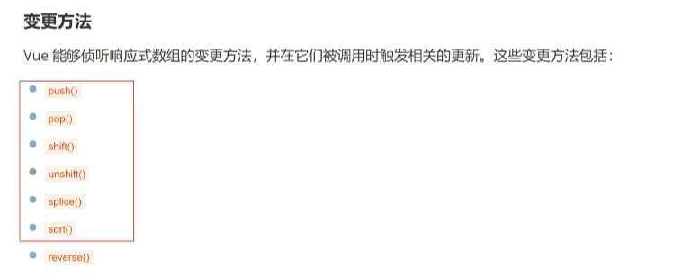
替换一个数组
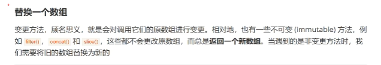
7. 计算属性
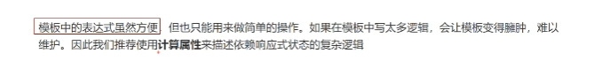
计算属性和方法的区别：
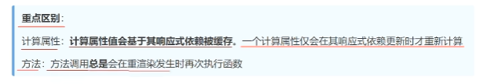
8. VUE的class绑定
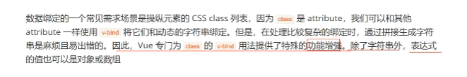
9. 如何理解条件判断

 10. 表单输入绑定的修饰符
 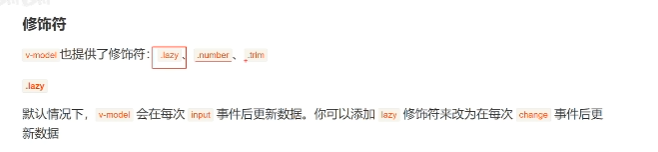
 11. VUE的组件组成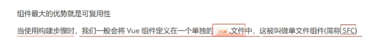
12. 组件的嵌套关系
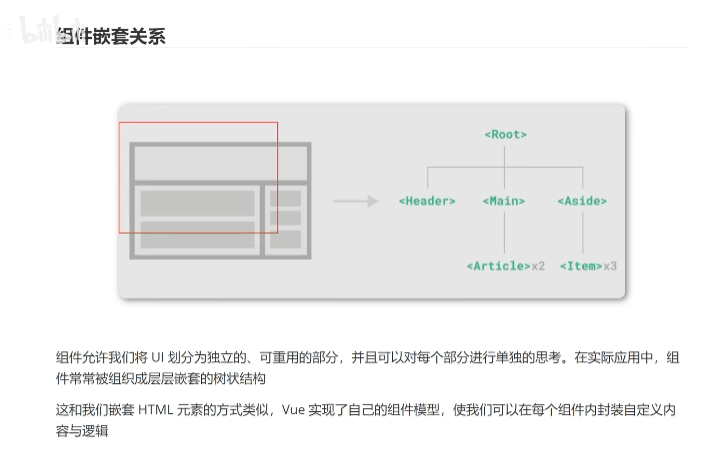
创建组件及引用关系
13. 全局注册和局部注册间的关系
 不推荐使用全局注册，还是推荐使用局部注册
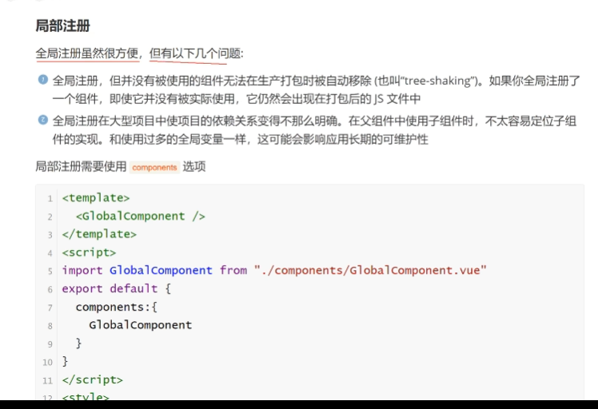
14. 对于VUE组件中的$emit方法的理解
~~~
在Vue中，`this.$emit` 是用于在子组件中触发自定义事件的方法。在这个方法中，第一个参数是事件的名称，也就是一个字符串，用于标识这个事件。这个事件名称可以自定义，你可以根据自己的需求来命名。

例如，`this.$emit("someEvent", "Child数据")` 中的 `"someEvent"` 就是自定义的事件名称。这个名称用于在父组件中监听这个事件，然后执行相应的操作。

当子组件调用 `this.$emit("someEvent", "Child数据")` 后，父组件可以通过在模板中监听这个事件来捕获触发的操作。例如：

```vue
<template>
  <div>
    <ChildComponent @someEvent="handleChildEvent" />
  </div>
</template>
```

在父组件中，`@someEvent="handleChildEvent"` 表示监听名为 `someEvent` 的事件，并在事件被触发时调用名为 `handleChildEvent` 的方法。当子组件中的 `this.$emit("someEvent", "Child数据")` 被调用时，父组件的 `handleChildEvent` 方法会被执行，可以在这个方法中获取子组件传递的数据 `"Child数据"`。

总之，事件名称作为 `this.$emit` 的第一个参数，用于定义一个自定义事件，使得子组件可以向父组件传递数据或通知父组件发生的事件。
~~~
**如果想用this.$emit传递多个参数的写法**
~~~
如果你想传递多个数据，你可以将这些数据包装成一个对象或数组，然后将整个对象或数组作为 `this.$emit` 的第二个参数进行传递。在父组件中，你可以通过监听事件的回调函数来获取整个对象或数组，然后根据需要进行解析和处理。

例如，假设你想传递多个数据项给父组件，你可以这样写：

在子组件：

```javascript
this.$emit("someEvent", { key1: value1, key2: value2, key3: value3 });
```

在父组件模板中监听事件：

```vue
<template>
  <div>
    <ChildComponent @someEvent="handleChildEvent" />
  </div>
</template>
```

在父组件的方法中处理事件：

```javascript
methods: {
  handleChildEvent(data) {
    console.log(data.key1); // 访问传递过来的数据项
    console.log(data.key2);
    console.log(data.key3);
  }
}
```

这样你就可以将多个数据项一起传递给父组件，并在父组件中获取和处理它们。

同样，你也可以使用数组来传递多个数据项，类似于：

在子组件：

```javascript
this.$emit("someEvent", [value1, value2, value3]);
```

在父组件方法中处理事件：

```javascript
methods: {
  handleChildEvent(dataArray) {
    console.log(dataArray[0]); // 访问传递过来的数据项
    console.log(dataArray[1]);
    console.log(dataArray[2]);
  }
}
```

无论使用对象还是数组，目标是将多个数据项封装在一个结构中，然后传递给父组件进行处理。
~~~
15. VUE组件的生命周期
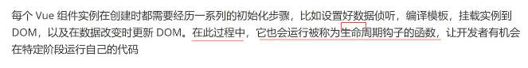
16. 利用VUE解决跨域问题
如何理解跨域：就是请求和当前服务器不一样的服务器域名和端口：
只有两种解决办法后端解决和前台解决
VUE可以做的只有前台解决
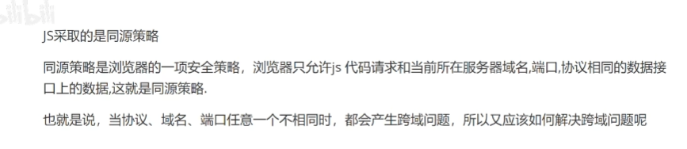
17.对于Vuex的理解
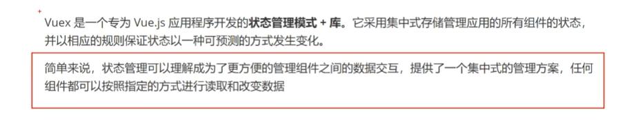
18. 对于Vuex中mutation的解释
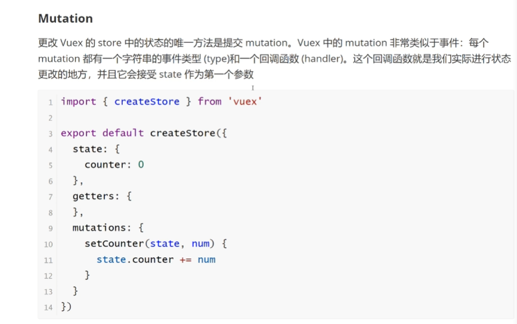
19. VUEX中的action
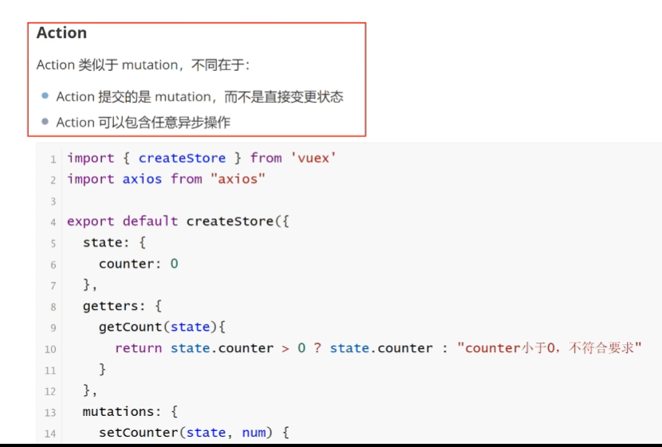
20. VUE3新特性
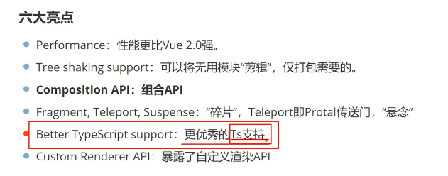
21. 对于padding的理解
