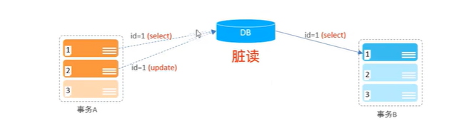
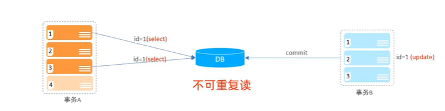
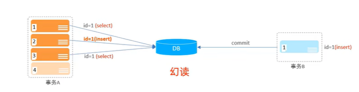

# SQL的基础知识
## SCHEMA SQL 和 QUERY SQL的区别
```
Schema SQL和Query SQL有不同的功能和用途。

Schema SQL（模式/结构化查询语言）：

用于定义数据库的结构和组织，包括表格、列、主键、索引、外键等元数据。
用于创建、修改或删除数据库对象，如表格、视图、存储过程、触发器等。
用于定义数据库对象之间的关系和约束，比如主键、外键、唯一性约束等。
用于定义数据类型和默认值。
用于定义数据库的注释和说明。
示例：上面提到的 "Create table" 语句就是一种Schema SQL，它用于创建一个新的表格，定义了表格的列、数据类型、约束和注释等信息。
Query SQL（查询查询语言）：

用于执行数据库查询操作，从数据库中检索数据。
用于对数据库中的数据进行增删改查，即插入、更新和删除数据。
用于对数据库进行聚合、排序、过滤和分组等数据处理操作。
用于创建和管理数据库视图，从现有的表格中抽象出一种虚拟表格。
用于执行存储过程和触发器。
示例：以下是一些Query SQL的例子：
SELECT * FROM table_name;：用于从表格中检索所有的数据。
INSERT INTO table_name (column1, column2, column3) VALUES (value1, value2, value3);：用于向表格中插入新数据。
UPDATE table_name SET column1 = value1, column2 = value2 WHERE condition;：用于更新表格中的数据。
DELETE FROM table_name WHERE condition;：用于从表格中删除符合条件的数据。
CREATE VIEW view_name AS SELECT column1, column2 FROM table_name WHERE condition;：用于创建一个视图。
总结：Schema SQL主要用于定义数据库的结构和组织，包括创建和管理数据库对象，而Query SQL主要用于执行查询和操作数据库中的数据。
```
## 事务的四大特性
1. 原子性（Atomicity）：事务是不可分割的最小操作单元，要么全部成功，要么全部失败
2. 一致性（Consistency）：事务完成时，必须所有的数据都保持一致状态。
3. 隔离性（Isolation）：数据库系统提供的**隔离机制**，保证事务不受外部并发操作影响的独立环境下运行。
4. 持久性（Durability）：事务一旦提交或回滚，它对数据库中的数据的改变就是永久的。
## 并发事务问题
1.对于并发事务的理解
```
并发事务是指在一个数据库系统中，同时有多个事务并行执行的情况。每个事务都是一系列数据库操作的集合，例如查询、插入、更新或删除数据等。并发事务允许多个用户或应用程序同时访问数据库并执行各自的操作，这样可以提高系统的处理能力和资源利用率。

理解并发事务需要考虑以下几个关键概念：

1. **事务（Transaction）**：事务是数据库操作的一个逻辑单元，它要么完全执行，要么完全不执行。一个事务中的操作要么全部成功提交，要么全部失败回滚，以保持数据库的一致性。

2. **并发（Concurrency）**：并发是指多个事务同时执行，它们在时间上可能会有重叠。并发可以提高系统的吞吐量和响应速度，但也可能引发一些问题，如数据冲突和不一致性。

3. **并发控制（Concurrency Control）**：并发控制是确保并发事务正确执行的一组技术和方法。它旨在避免并发事务之间的冲突和数据不一致性。最常见的并发控制方法包括锁机制、并发事务的隔离级别等。

4. **锁（Locking）**：锁是并发控制中常用的一种机制，用于控制对共享资源（如数据库表格、行、列等）的访问。锁可以防止其他事务在某个事务正在使用资源时修改或访问该资源，从而避免数据冲突。

5. **并发事务隔离级别**：数据库管理系统支持多种并发事务隔离级别，如读未提交、读已提交、可重复读和串行化等。不同的隔离级别决定了在并发环境中事务之间的可见性和互动程度。

6. **脏读、幻读和不可重复读**：这些是并发事务中可能出现的问题。脏读是指读取到了未提交的数据，幻读是指在同一个事务中多次读取数据得到不一致的结果，不可重复读是指在同一个事务中多次读取数据得到不同的结果。

并发事务管理是数据库系统中非常重要的一个方面，它需要仔细考虑并发控制的机制，以确保在多个事务同时执行时，数据库的数据保持一致性和正确性。不正确的并发事务管理可能导致数据不一致、丢失或破坏，因此在设计和开发数据库应用时要慎重考虑并发性。
```
2. 并发事务中可能会遇到的问题：
   |问题|描述|
   | ----------- | ----------- |
   |脏读|一个事务督导另外一个事务还没有提交的数据|
   |不可重复读|一个事务先后读取同一条记录，但两次读取的数据不同，称之为不可重复读|
   |幻读|一个事务按照条件查询数据时，没有对应的数据行|，但是在插入数据时，又发现这行数据已经存在了，好像出现了“幻影”|
   
   
   
   
   ## 事务的隔离级别：解决并发事务问题
   1. 四种隔离级别与对应能解决的并发事务问题
     |隔离级别|脏读|不可重复度|幻读|
	 |Read uncommitted| ✔|✔|✔|
	 |Read committed（Orcal默认）|✔|✘|✘|
	 |Repeatable Read（Mysql默认）|✔|✔|✘|
	 |Serializable|✘|✘|✘|
2. 四种隔离级别所对应的意义
  ```
 四种隔离级别是指数据库管理系统定义的不同事务并发控制级别，用于控制并发事务之间的可见性和互动程度。这些隔离级别旨在解决并发事务可能引发的问题，如脏读、幻读和不可重复读。下面是对四种隔离级别的简要解释：

1. **读未提交（Read Uncommitted）**：
   - 最低级别的隔离，允许一个事务读取另一个事务尚未提交的数据。
   - 可能导致脏读、幻读和不可重复读问题。
   - 并发性最高，但数据的一致性和完整性风险最大。

2. **读已提交（Read Committed）**：
   - 允许一个事务只能读取另一个事务已经提交的数据。
   - 可避免脏读问题，但仍可能遇到幻读和不可重复读问题。
   - 是许多数据库系统的默认隔离级别。

3. **可重复读（Repeatable Read）**：
   - 保证一个事务在同一查询中多次读取相同数据时，能够看到一致的结果。
   - 防止脏读和不可重复读问题，但仍可能出现幻读问题。
   - 保证了在事务执行期间其他事务不会修改读取的数据。

4. **串行化（Serializable）**：
   - 最高级别的隔离，确保每个事务是串行执行的，即每个事务都完全独立，不会受到其他事务的干扰。
   - 避免了脏读、幻读和不可重复读问题，但会牺牲并发性能，可能导致系统响应变慢。

在选择隔离级别时，需要权衡并发性和数据一致性之间的平衡。较低的隔离级别可以提高并发性能，但可能导致数据不一致，较高的隔离级别可以确保数据一致性，但可能降低并发性能。选择适当的隔离级别取决于具体应用的需求和对数据一致性的要求。有些数据库系统可能提供更多的隔离级别选项，但四种基本的隔离级别是最常见和广泛支持的。
```
3. 事务隔离级别的代码操作
   查看事务的隔离级别
   SELECT @@TRANSACTION_ISOLATION;
   设置事务隔离级别
   SET [SESSION | GlOBAL] TRANSACTION ISOLATION LEVEL [READ UNCOMMITED | READ COMMITED | REPEATABLE READ | SERIALIZABLE]
4. 用两个cmd命令行模拟并发事务
```
mysql -u root -p
use XXXX
下边是sql语句就是

```
 ## 事务操作
  ### 控制事务提交方式一
  1. 查看/设置事务提交方式
     Select @@autocommit;
	 SET @@autocommit = 0;
  2. 提交事务
     COMMIT
3. 回滚事务
   ROLLBACK;
   
 练习一：
```
 select @@autocommit;
 用于查询事务提交方式，如果是1的话，代表自动提交
 SET @@autocommit = 0;
 将事务设置为手动提交（手动Commit）
 
CREATE TABLE account(
    id int auto_increment primary key comment '主键ID',
    name varchar(10) comment '姓名',
    money int comment '余额'
) comment '账户表';
// 里面的comment是注释的意思

底下的是Schema SQL
insert into account(id, name, money) VALUES (null , '张三', 1500), (null, '李四', 2000);
select * from account;

select @@autocommit;

SET @@autocommit = 0; 

select * from account where name = '张三';

update account set money = money - 1000 where name = '张三';

update account set money = money + 1000 where name = '李四';

commit;

-- 如果执行失误，需要进行回滚,保证数据的正确性和完整性
rollback;

-- 
```
 下边的是一些解释
```
这句SQL是用于创建一个名为 'account' 的表格（表）。

让我逐一解释每个部分：

1. `CREATE TABLE`: 这是一个SQL语句，用于创建数据库中的新表格。

2. `'account'`: 这是要创建的表格的名称。表格名用单引号括起来，表格名可以是任何有效的标识符。

3. `(`: 这个括号表示接下来要定义表格的列。

4. `id int auto_increment primary key comment '主键ID',`: 这是第一列的定义。它包含了以下内容：
   - `id`: 列名，表示该列的名称。
   - `int`: 数据类型，表示该列将存储整数（没有小数）。
   - `auto_increment`: 这是列的属性，它表示当插入新行时，ID值会自动增加，通常用于创建唯一的主键值。
   - `primary key`: 这是列的约束，表示该列是表格的主键，用于唯一标识每一行数据。
   - `comment '主键ID'`: 这是对列的注释，提供了关于该列用途的说明。

5. `name varchar(10) comment '姓名',`: 这是第二列的定义。它包含了以下内容：
   - `name`: 列名，表示该列的名称。
   - `varchar(10)`: 数据类型，表示该列将存储最大长度为10的变长字符串（文本）。
   - `comment '姓名'`: 这是对列的注释，提供了关于该列用途的说明。

6. `money int comment '余额'`: 这是第三列的定义。它包含了以下内容：
   - `money`: 列名，表示该列的名称。
   - `int`: 数据类型，表示该列将存储整数（没有小数）。
   - `comment '余额'`: 这是对列的注释，提供了关于该列用途的说明。

7. `)`: 这个括号表示表格列的定义结束。

8. `comment '账户表'`: 这是对整个表格的注释，提供了关于表格用途的说明。

总结：这条SQL语句创建了一个名为 'account' 的表格，表格包含了三列：'id'、'name'、'money'。'id'列是表格的主键，用于唯一标识每一行数据。'name'列用于存储最大长度为10的姓名，'money'列用于存储整数类型的余额。整个表格还有一个注释说明其用途为 "账户表"。

`auto_increment` 是一种列属性，通常用于设置一个列为自增长的方式。当在插入新记录时，这个自增长的列会自动递增，每次插入新数据时，其值会自动比上一条记录的值大1。

主要特点和功能如下：

1. **自动生成唯一值**：`auto_increment` 通常用于创建主键列（Primary Key），确保每个新插入的记录都具有唯一的标识符，从而避免重复的主键值。

2. **无需显式指定值**：当插入数据时，无需为 `auto_increment` 列指定具体的值，数据库会自动为该列分配递增的值。

3. **整数递增**：通常情况下，`auto_increment` 只用于整数类型的列，比如 `int` 或 `bigint`。

4. **适用于单一列**：一张表中只能有一个 `auto_increment` 列，它用于表格的主键。

5. **可与其他属性组合**：`auto_increment` 可以与其他属性组合使用，比如与 `primary key` 一起用于创建主键列。

例如，在上面提到的创建表格的SQL语句中，`id` 列被设置为 `auto_increment`，这意味着当向表格中插入新记录时，不需要手动为 `id` 列指定值，数据库会自动分配递增的唯一值给该列。这样确保了每个记录都有唯一的 `id` 值作为主键标识。
```
  ### 控制事务的方式二
  1. 开启事务
     START TRANSACTION 或 BEGIN;
2. 提交事务
   COMMIT;
   3. 回滚事务
     ROLLBACK;
```
insert into account(id, name, money) VALUES (null , '张三', 1500), (null, '李四', 2000);
select * from account;

select @@autocommit;

SET @@autocommit = 1; 

start transaction;

select * from account where name = '张三';

update account set money = money - 1000 where name = '张三';

update account set money = money + 1000 where name = '李四';

commit;

-- 如果执行失误，需要进行回滚,保证数据的正确性和完整性
rollback;
```