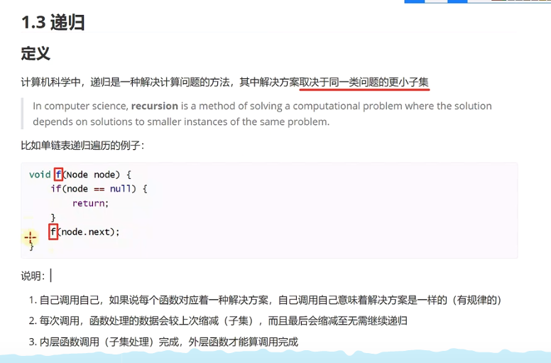
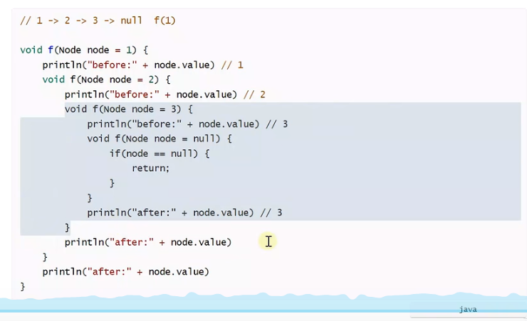
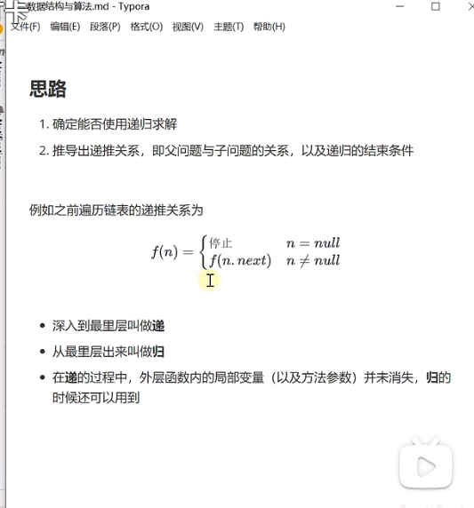
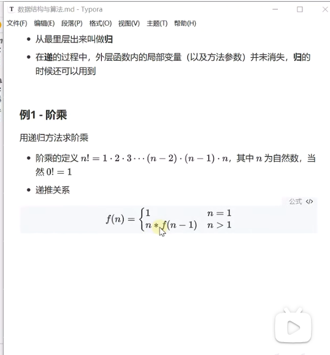
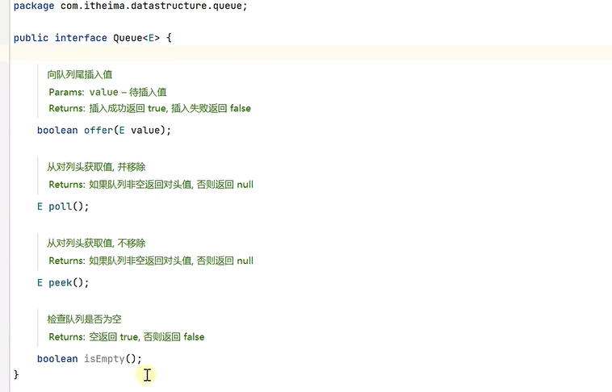
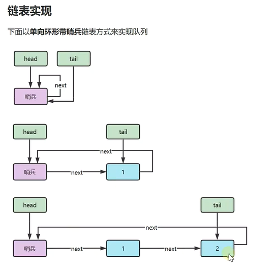

----------

# 算法基础知识
## 对于递归的理解
对于递归算法时间复杂度的理解：
递归算法的时间复杂度？ - 代码随想录的回答 - 知乎
https://www.zhihu.com/question/63075755/answer/1151037825				
1. java实例
~~~
private void recursion(Node curr, Consumer<Integer> before,
                           Consumer<Integer> after){
        if (curr == null){
            return;
        }

        // 如果代码顺序换一下，会发现是逆序打印
        // 打印出来是一个逆序，一个倒序
        before.accept(curr.value);
        recursion(curr.next, before, after);
        after.accept(curr.value);
    }


~~~
2. 递归的定义
  
3. 单链表递归的阐述

4. 问题是否能用递归进行解决
   
   能否被分为夫父问题和子问题，父问题和子问题能不能用同一种方法解决
5. 例一：


``` java

```
6. 在java中函数返回两个元素
~~~
在Java中，一个方法只能返回一个值。然而，你可以通过不同的方式来返回多个元素。以下是一些常见的方法：

1. **使用数组：** 你可以创建一个数组来存储多个元素，并将该数组作为方法的返回值。

```java
public static int[] returnTwoNumbers() {
    int[] numbers = { 10, 20 };
    return numbers;
}

public static void main(String[] args) {
    int[] result = returnTwoNumbers();
    System.out.println("Number 1: " + result[0]);
    System.out.println("Number 2: " + result[1]);
}
```

2. **使用自定义对象：** 你可以创建一个包含多个属性的自定义对象，并将该对象作为方法的返回值。

```java
public class NumberPair {
    private int number1;
    private int number2;

    public NumberPair(int number1, int number2) {
        this.number1 = number1;
        this.number2 = number2;
    }

    public int getNumber1() {
        return number1;
    }

    public int getNumber2() {
        return number2;
    }
}

public static NumberPair returnTwoNumbers() {
    return new NumberPair(10, 20);
}

public static void main(String[] args) {
    NumberPair result = returnTwoNumbers();
    System.out.println("Number 1: " + result.getNumber1());
    System.out.println("Number 2: " + result.getNumber2());
}
```

3. **使用集合类：** 你可以使用Java中的集合类（如List、Map等）来存储多个元素，并将集合作为方法的返回值。

```java
import java.util.ArrayList;
import java.util.List;

public static List<Integer> returnTwoNumbers() {
    List<Integer> numbers = new ArrayList<>();
    numbers.add(10);
    numbers.add(20);
    return numbers;
}

public static void main(String[] args) {
    List<Integer> result = returnTwoNumbers();
    System.out.println("Number 1: " + result.get(0));
    System.out.println("Number 2: " + result.get(1));
}

请注意，以上方法中的返回类型分别是数组、自定义对象和集合，你可以根据实际需要选择其中之一。另外，如果要返回更复杂的数据结构，还可以使用Map等。
~~~

7. java中的逻辑运算符

``` javascript
在Java中，逻辑运算符用于对布尔类型的值进行操作和组合，常用于控制流程、条件判断等场景。以下是Java中常用的逻辑运算符：

1. **逻辑与 (&&)：** 如果两个操作数都为 `true`，则结果为 `true`，否则为 `false`。

```java
boolean a = true;
boolean b = false;
boolean result = a && b;  // result 的值为 false
```

2. **逻辑或 (||)：** 如果两个操作数中至少有一个为 `true`，则结果为 `true`，否则为 `false`。

```java
boolean a = true;
boolean b = false;
boolean result = a || b;  // result 的值为 true
```

3. **逻辑非 (!)：** 用于取反操作，如果操作数为 `true`，则结果为 `false`，如果操作数为 `false`，则结果为 `true`。

```java
boolean a = true;
boolean result = !a;  // result 的值为 false
```

这些逻辑运算符可以通过组合使用来构建复杂的布尔表达式，用于条件判断、循环控制和逻辑判断等情况。例如：

```java
int x = 5;
int y = 10;

boolean condition1 = x > 0 && y < 20;  // true
boolean condition2 = x > 0 || y > 20;  // true
boolean condition3 = !(x < y);         // false
```

另外，逻辑运算符具有短路求值的特性。在逻辑与 (`&&`) 中，如果第一个操作数为 `false`，则不会执行第二个操作数的求值；在逻辑或 (`||`) 中，如果第一个操作数为 `true`，则不会执行第二个操作数的求值。这种特性可以用来优化代码，避免不必要的计算。
~~~

~~~
## 队列
 1. 队列的链表实现
 - 队列中的基本属性和方法

- 对于单向环形链表的理解
  其实单向环形链表带哨兵要看最后的Node
  如果在初始定义中Node是一个value和next，那么直接按照这个定义来即可
  
  