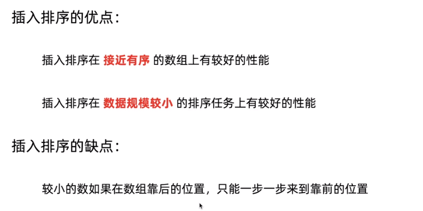

----------

# 算法基础知识
## 对于递归的理解
1. java实例
~~~
private void recursion(Node curr, Consumer<Integer> before,
                           Consumer<Integer> after){
        if (curr == null){
            return;
        }

        // 如果代码顺序换一下，会发现是逆序打印
        // 打印出来是一个逆序，一个倒序
        before.accept(curr.value);
        recursion(curr.next, before, after);
        after.accept(curr.value);
    }

~~~
2. 尾递归避免爆栈

### 递归的时间复杂度求解
1. 主定理求时间复杂度
 
 2. 展开式计算
 ## 对于二分查找的理解
  1. 二分查找就关注两个值，一个是dd_new，一个是dd_or，关注这两个值的变化就好
  2. 二分查找中的+1和-1如何理解
 ## 排序算法
 1. 插入排序和冒泡排序的思想差异有哪些，在哪些应用场景下会不一样？
    冒泡排序一般是铁n的平方，但是插入排序在基本有序的情况下，时间复杂度会更低
> 插入排序和冒泡排序是两种基本的排序算法，它们的思想有些不同，也在一些应用场景上存在差异。

**插入排序：**

插入排序的思想是将数组分为两部分，一部分是已排序的，一部分是未排序的。它逐个将未排序的元素插入到已排序的部分中，以保持已排序部分的有序性。

1. 从第一个元素开始，认为它已经是有序的部分。
2. 取出下一个元素，将其插入到已排序的部分，使得有序部分仍然有序。
3. 重复上一步，直到所有元素都被插入到有序部分中。

**冒泡排序：**

冒泡排序的思想是通过不断交换相邻的元素，将最大（或最小）的元素逐步冒泡到数组的一端，实现排序。

1. 从数组的第一个元素开始，比较相邻的两个元素，如果顺序不正确，则交换它们。
2. 重复上一步，直到数组末尾，此时最大的元素已经“冒泡”到了最后一个位置。
3. 重复上述步骤，每次将下一个最大的元素冒泡到倒数第二个位置，然后倒数第三个位置，以此类推。

**差异和应用场景：**

- 插入排序通常在元素较少或基本有序的情况下效果较好，因为它在已排序的部分中查找插入位置，不会像冒泡排序那样需要不断交换。所以，在某些小规模或基本有序的情况下，插入排序可能比冒泡排序更快。

- 冒泡排序每次都会进行相邻元素的交换，这可能导致在某些情况下效率较低，尤其是当要排序的数组已经基本有序时。然而，冒泡排序的优势是在每一轮排序中都可以确定一个元素的最终位置。

- 由于插入排序只涉及到有序部分的元素比较，它在一些情况下比冒泡排序更快。但是，对于大规模乱序的数组，插入排序的性能可能不如其他更高效的排序算法（如快速排序、归并排序等）。

总之，插入排序和冒泡排序都是最基本的排序算法，适用于一些特定的情况。在实际应用中，如果需要排序大规模乱序的数据，通常会使用更高效的排序算法。
2. 插入排序的优点
  
  3. 希尔排序的基本优点
    
	

 